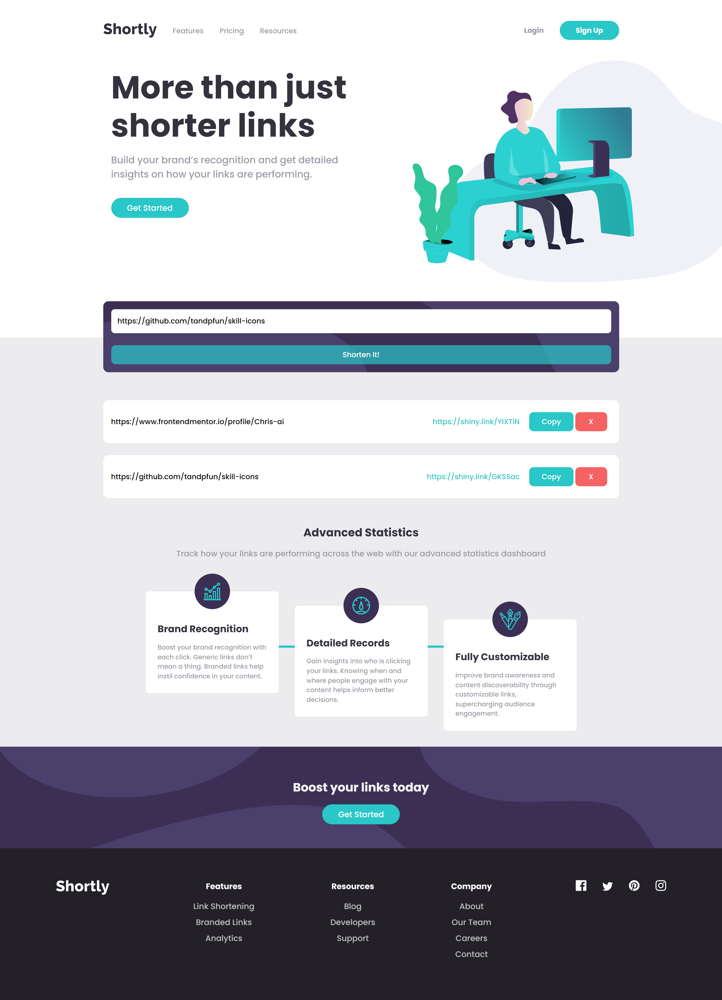

# Shortly - URL shortening API

This is a solution to the [E-commerce product page challenge on Frontend Mentor](https://www.frontendmentor.io/challenges/ecommerce-product-page-UPsZ9MJp6). This project is a single web application to shorten links using the shrtco.de API. The site was built using a JS framework called `Vue.js`. The site is fully responsive and the `CSS`, written using the `SCSS` preprocessor is fully proprietary. I used a javascript library called `axios` to retrieve api requests.

# 📝 Table of contents

- [Overview](#overview)
  - [The challenge](#the-challenge)
  - [Live Demo](#live-demo)
  - [Screenshot](#screenshot)
- [Tech stack](#tech-stack)
  - [Built with](#built-with)
  - [API reference](#api-reference)
- [Installation](#installation)
- [Author](#author)

# ✏️ Overview

Users should be able to:

- View the optimal layout for the site depending on their device's screen size
- Shorten any valid URL
- See a list of their shortened links, even after refreshing the browser
- Copy the shortened link to their clipboard in a single click
- Receive an error message when the `form` is submitted if:
  - The `input` field is empty

# 🟢 Live demo - [Shortly](https://chris-ai.github.io/link-shorterer/)

# 📷 Screenshot



# 📚 Tech stack

## Built with

[](https://skills.thijs.gg)

## API reference

## [Shrtcode](https://shrtco.de/docs)

# ➡️ Installation

```
npm install
```

### Compiles and hot-reloads for development

```
npm run serve
```

### Compiles and minifies for production

```
npm run build
```

### Lints and fixes files

```
npm run lint
```

# 🔗 Author

[](https://github.com/Chris-ai)

[](https://twitter.com/kondr7_krzysiek)

[](https://www.frontendmentor.io/profile/Chris-ai)
